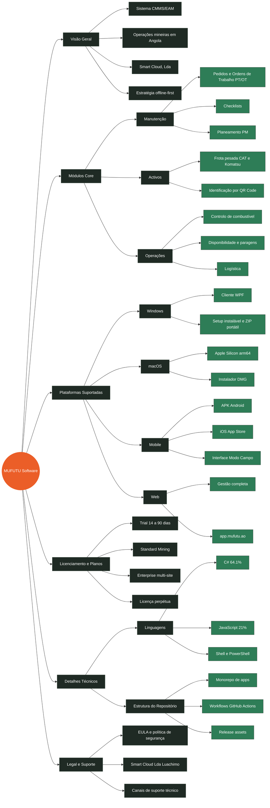

# Mapa Mental — MUFUTU Software

Visão global do produto, plataformas, licenciamento e suporte. O GitHub renderiza
o diagrama abaixo automaticamente (Mermaid — `flowchart`, suportado de forma
estável em qualquer repositório; o tipo `mindmap` é experimental e nem sempre
renderiza no GitHub).

## Ligações rápidas

| Ramo | Onde está |
|------|-----------|
| Cliente Windows (WPF), macOS (Electron), Mobile (MAUI) — código-fonte | `apps/desktop-win/`, `apps/electron/`, `apps/mobile-maui/` no repositório privado `mufutu` |
| Workflows CI/CD (fazem checkout do `mufutu`) | [`.github/workflows/`](../.github/workflows/) |
| Identidade visual | [`assets/brand/`](../assets/brand/) |
| Guias de instalação por plataforma | [`windows/`](../windows/) · [`macos/`](../macos/) · [`android/`](../android/) · [`ios/`](../ios/) · [`web/`](../web/) |
| Licenciamento e EULA | [`EULA.md`](../EULA.md) · [`LICENSE`](../LICENSE) |
| Segurança | [`SECURITY.md`](../SECURITY.md) |
| Política de repositórios (público vs privado) | [`POLITICA_REPOSITORIOS.md`](POLITICA_REPOSITORIOS.md) |
