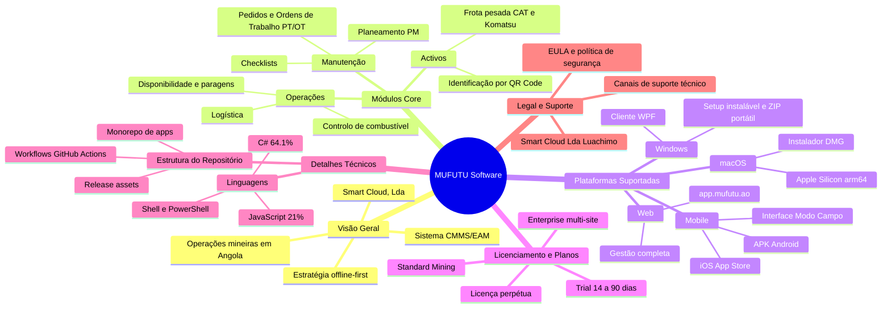

# Mapa Mental — MUFUTU Software

Visão global do produto, plataformas, licenciamento e suporte. O GitHub renderiza
o diagrama abaixo automaticamente (Mermaid).

## Ligações rápidas

| Ramo | Onde está no repositório |
|------|--------------------------|
| Cliente Windows (WPF) | [`apps/desktop-win/`](../apps/desktop-win/) |
| Cliente macOS (Electron) | [`apps/electron/`](../apps/electron/) + [`apps/desktop-mac/`](../apps/desktop-mac/) |
| Mobile Android/iOS (MAUI) | [`apps/mobile-maui/`](../apps/mobile-maui/) |
| Workflows CI/CD | [`.github/workflows/`](../.github/workflows/) |
| Identidade visual | [`assets/brand/`](../assets/brand/) |
| Guias por plataforma | [`windows/`](../windows/) · [`macos/`](../macos/) · [`android/`](../android/) · [`ios/`](../ios/) · [`web/`](../web/) |
| Licenciamento e EULA | [`EULA.md`](../EULA.md) · [`LICENSE`](../LICENSE) |
| Segurança | [`SECURITY.md`](../SECURITY.md) |
| Plano de melhoria | [`PLANO-DE-MELHORIA.md`](PLANO-DE-MELHORIA.md) |
