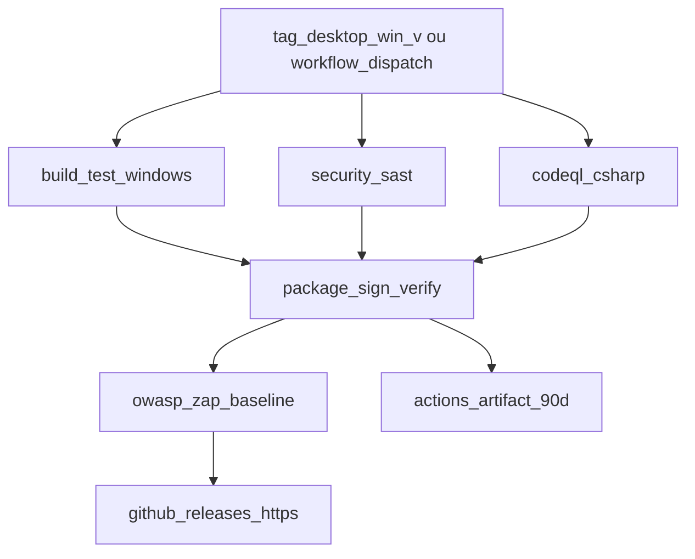

# Pipeline Windows Desktop — Build, Segurança e Release

Workflow: [`.github/workflows/desktop-win.yml`](../.github/workflows/desktop-win.yml)

> **Não usar Dokploy** para o cliente Windows. O build corre em **GitHub Actions** (`windows-latest`); os instaladores publicam-se em **GitHub Releases** (HTTPS). A pasta `apps/desktop-win/` está excluída do contexto Docker (`.dockerignore`) para não aumentar imagens web/api no servidor.

## Fluxo



## Disparar build

### Release (publica em GitHub Releases via HTTPS)

```bash
git tag desktop-win/v1.0.0
git push origin desktop-win/v1.0.0
```

### Manual (GitHub Actions → «Windows Desktop (WPF)» → Run workflow)

Opcional: input `version` (default `1.0.0`).

## Build local (Windows + PowerShell)

```powershell
cd apps/desktop-win
.\scripts\package.ps1 -Version 1.0.0
```

Saída: `artifacts/installer/` (MSI, setup EXE ou ZIP fallback) + `checksums.sha256` + `manifest.json`.

## Secrets GitHub

| Secret                  | Obrigatório | Descrição                                                      |
| ----------------------- | ----------- | -------------------------------------------------------------- |
| `WIN_CODESIGN_PFX`      | Não         | PFX em base64 — se vazio, CI gera self-signed                  |
| `WIN_CODESIGN_PASSWORD` | Não         | Password do PFX (default dev: ver script)                      |
| `ZAP_BASE_URL`          | Não         | URL API para pentest passivo (default `https://app.mufutu.ao`) |

### Certificado comercial (PFX)

Se já tens um `.pfx` (ex. `certificate.pfx`):

```bash
# 1. GitHub — PFX em base64 (já pode estar configurado como WIN_CODESIGN_PFX)
base64 -i /caminho/para/certificate.pfx | gh secret set WIN_CODESIGN_PFX --repo osvaldowafulua/mufutu

# 2. Password do PFX
gh secret set WIN_CODESIGN_PASSWORD --repo osvaldowafulua/mufutu
# (o CLI pede a password — não commitar)

# 3. Re-disparar release
git tag -f desktop-win/v1.0.1 && git push origin desktop-win/v1.0.1 --force
```

O workflow **não** gera self-signed se `WIN_CODESIGN_PFX` existir nos secrets.

### Gerar certificado self-signed (só dev / sem PFX)

```powershell
cd apps/desktop-win
.\scripts\generate-selfsigned-cert.ps1
```

Copiar output base64 para `WIN_CODESIGN_PFX` e a password para `WIN_CODESIGN_PASSWORD`.

**SmartScreen:** utilizadores verão «Editor desconhecido». Para distribuição externa, adquirir certificado OV/EV (~200–400 USD/ano) ou [SignPath](https://signpath.org/) se open-source.

## Etapas de segurança

| Etapa          | Ferramenta                                                     |
| -------------- | -------------------------------------------------------------- |
| SAST           | SecurityCodeScan (Roslyn), `dotnet list package --vulnerable`  |
| CodeQL         | `github/codeql-action` (C#)                                    |
| Ofuscação      | Obfuscar (`scripts/obfuscar.xml`) — Core + Licensing           |
| Pentest básico | OWASP ZAP baseline (API staging)                               |
| Integridade    | `scripts/verify-artifact.ps1` — SHA-256, SHA-512, Authenticode |

## Verificar instalador no cliente

```powershell
# Hash
Get-FileHash .\MUFUTU-Setup.exe -Algorithm SHA256

# Assinatura
Get-AuthenticodeSignature .\MUFUTU-Setup.exe
```

Comparar SHA-256 com `checksums.sha256` publicado no GitHub Release.

## Pipeline no Cursor

1. **Testes locais (Mac/Linux):** só `Core` + `Licensing` + testes:
   ```bash
   cd apps/desktop-win
   dotnet test tests/Mufutu.Desktop.Tests -c Release
   ```
2. **Build WPF completo:** requer Windows — usar CI ou VM.
3. **Ver logs CI:** GitHub → Actions → «Windows Desktop (WPF)» → job `Package, Sign & Verify` → artefacto `mufutu-desktop-installer`.
4. **Logs de build:** pasta `artifacts/logs/` (restore, test, publish, obfuscar, wix, signtool).

## Canal de distribuição

- **Único canal oficial:** [GitHub Releases](https://github.com/osvaldowafulua/mufutu/releases) (HTTPS) — tags `desktop-win/v*`
- **Artefactos CI:** GitHub Actions → job «Package, Sign & Verify» → `mufutu-desktop-installer` (90 dias)
- **Dokploy:** não aplicável — sem container, sem compose, sem upload para o VPS
- **Fase 2 (opcional):** espelhar release para CDN (`downloads.mufutu.ao`) a partir do GitHub, não do Dokploy

## Upgrade para certificado comercial

1. Comprar certificado Code Signing (DigiCert, Sectigo, etc.)
2. Exportar PFX → `WIN_CODESIGN_PFX` + `WIN_CODESIGN_PASSWORD`
3. Re-tag release — `signtool` usa automaticamente o certificado dos secrets
4. Acumular reputação SmartScreen com downloads legítimos
